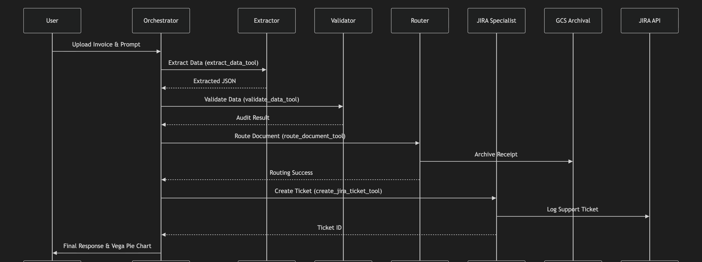
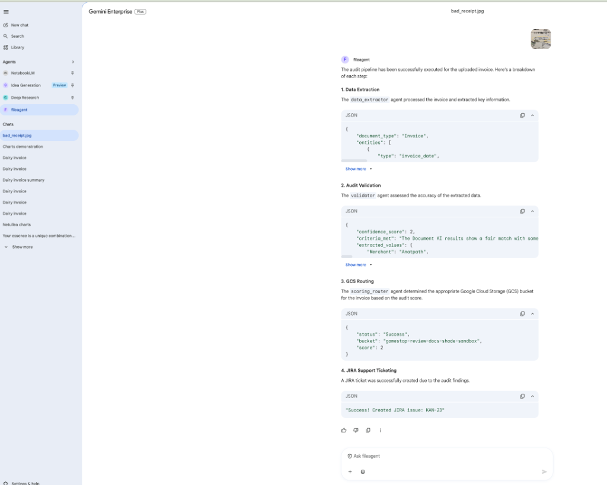

# Standalone A2UI Retail Store Invoice Auditor Agent

This folder contains a flat, modular **Google Agent Development Kit (ADK)** agent workspace that implements a robust **A2A (Agent-to-Agent)** protocol and **A2UI (Agent-driven User Interface)** extension designed to automate retail store receipt auditing, data validation, cloud archival GCS routing, helpdesk JIRA ticketing, and interactive visual breakdown charting rendered natively in **Google Cloud Gemini Enterprise**.

---

## 🎯 Core Capabilities

The system provides an automated, end-to-end store invoice auditing pipeline with the following capabilities:

*   **Automated Data Extraction**: Employs advanced parsing models to analyze variable-format store receipts and invoices, cleanly extracting key store taxonomies (Merchant name, address, phone), transaction headers (Date, Time, Cashier ID), financial summaries (Subtotal, Tax, Total, Payment Method), and granular line-item details.
*   **Dual-Model Visual Audit Validation**: Combines the structured output of Google Cloud Document AI with the visual spatial reasoning of **Gemini 2.5 Flash**. It performs a line-by-line, visually grounded comparison to check for discrepancies between the extracted data and the original document image, scoring confidence on a 1–3 scale.
*   **GCS Cloud Archival & Routing**: Automatically evaluates audit confidence.
    *   **Score 3 (Perfect Match)**: Archives the document directly in the GCS Processed bucket.
    *   **Score < 3 (Discrepancy/Anomaly)**: Routes the document to the GCS Human Review bucket for manual intervention.
*   **Dynamic JIRA Ticketing Coordinator**: When a discrepancy is flagged (Score < 3), the router delegates to automatically log a support ticket with a structured finding report (including discrepancy summaries and GCS review links) on your Atlassian Cloud support board.
*   **Interactive Visual A2UI Breakdown Charting**: Generates a beautiful declarative Vega-Lite pie chart representing the visual expense breakdown of the final total (mapping each line item and the tax to a slice of the pie) rendered natively inside your Gemini Enterprise chat window.

---

## 📷 Sample B2B Test Invoice Example

Below is the high-resolution B2B enterprise invoice image asset used for validating extraction inside the pipeline:


---

## 🏗️ Architecture & Flow

This project demonstrates the **Agent-to-Agent (A2A)** protocol and **A2UI** extension in Google Cloud Gemini Enterprise.

### Architecture & Tools Flowchart

Below is the modular tools-and-agent execution pipeline flowchart:


Gemini Enterprise acts as the frontend orchestrator. When a user interacts with an agent that requires custom UI or specific tools, the flow is as follows:

- **Gemini Enterprise (GE)**: The main user interface and orchestrator.
- **Agent Engine (Reasoning Engine)**: Hosts the custom Python agent code.
- **A2UI Extension**: Defines how the agent can send structured UI data (like cards and charts) back to GE to be rendered.

### Why A2A and A2UI?

We use the **A2A (Agent-to-Agent)** pattern and **A2UI** extension for several key reasons:

1. **Decoupling**: Gemini Enterprise doesn't need to know the specific logic or data structure of every specialized agent. A2A provides a standard communication protocol.
2. **Rich Interactive Experience**: Standard chat is limited to text. A2UI allows agents to return rich, structured components (like contact cards and interactive charts) that render natively in the Gemini Enterprise chat interface.
3. **Dynamic Extensibility**: Specialized agents can provide specific visualizations tailored to the user's request (e.g., a VegaChart for pricing, a profile card for contacts) without requiring updates to the main Gemini Enterprise application UI.
4. **Security First**: Instead of sending executable HTML or JavaScript (which carries security risks across trust boundaries), A2UI uses a **declarative JSON-based protocol**. The client application maintains a catalog of trusted components, reducing the risk of UI injection.
5. **LLM-Friendly**: The UI is represented as a flat list of components with ID references, making it easy for LLMs to generate and update incrementally.

### Sequence Diagram

Here is the flow of a request from the user to the agent and back:



**Reflection on the Diagram:**
- **A2A (Agent-to-Agent)**: The arrows between *Gemini Enterprise* and *Custom Agent* represent the A2A protocol. It passes the user's intent and context in a standard request, and receives the answer (both text and UI) in a standard response.
- **A2UI (Agent UI)**: The step where the *Custom Agent* wraps the data in `a2ui-json` and returns it, and *Gemini Enterprise* renders the VegaChart, illustrates the A2UI extension. The agent dictates the UI structure, and the platform handles the rendering.


---

## 📷 Live Gemini Enterprise Execution Example

Below is the custom A2UI store auditor running natively inside your **Gemini Enterprise** chat assistant interface, executing the full extraction, GCS review routing, JIRA ticketing, and rich visual A2UI pie chart rendering in real-time:



### Atlassian Cloud JIRA Automated Ticketing

If the Gemini Visual Auditor flags any discrepancies or anomalies (Confidence Score < 3), the integrated JIRA client programmatically logs a high-priority support task inside your Atlassian Cloud JIRA board:

*   **Direct Native Integration**: Driven using the lightweight `atlassian-python-api` library, completely bypassing the need for complex local or remote MCP servers.
*   **Secure Credentials**: Uses basic authentication via `JIRA_EMAIL` and `JIRA_API_TOKEN` loaded dynamically from your `.env` file (and fully containerized in Vertex AI `env_vars`).
*   **Rich Finding Reports**: Automatically populates the JIRA task description with a detailed discrepancy summary, Cashier ID, transaction totals, cashier metadata, and the GCS cloud review bucket archival URI for immediate human intervention.


---

## 📁 Flat Staging Reorganized Package Structure

The project utilizes a **Hybrid Layout** that seamlessly supports local developer CLI emulators (`adk web`, `adk run` which seek flat entry points) and serverless Google Cloud Vertex AI Reasoning Engine Builders (which require subdirectory python packages in `extra_packages` configuration parameters):

```text
GE_fileagent_a2ui/
├── agent.py             # Root wrapper entry point (exposing root_agent)
├── executor.py          # Custom StoreAuditorExecutor executing A2A protocol
├── tools.py             # Custom tools (including audit_invoice_tool & analyze_uploaded_invoice_tool)
├── document_parser.py   # Document AI parser client
├── gemini_parser.py     # Gemini visual auditor client
├── adk_app.py           # adk web entry point
├── deploy.py            # Unified deploy script
├── register.py          # Dynamic registration helper script
├── pyproject.toml       # Poetry/UV workspace configuration
├── requirements.txt     # Pinned container dependencies
├── .env                 # Configuration tokens (Vertex AI, GCS, JIRA)
├── README.md            # Unified Deployment and Architecture Guide
├── assets/              # High-resolution visual diagram and B2B invoice assets
├── examples/            # Catalog A2UI JSON examples
└── tests/               # Integration test suite
```

---

## ⚙️ Local .env Configuration

Create a `.env` file in the root directory and fill in the following variables:

```env
# 1. Bypass setting for corporate OpenSSL mTLS checks (Mandatory!)
GOOGLE_API_USE_CLIENT_CERTIFICATE=false

# 2. Vertex AI Cloud settings
GOOGLE_GENAI_USE_VERTEXAI=true
PROJECT_ID=<GCP_PROJECT_ID>
LOCATION=us-central1
STORAGE_BUCKET=gs://<YOUR_STAGING_BUCKET_NAME>
GEMINI_ENTERPRISE_APP_ID=<GEMINI_ENTERPRISE_APP_ID>

# 3. Google Cloud Storage (GCS) Archival Buckets
NESS_PROCESSED_DOCS_BUCKET=gamestop-processed-docs-<GCP_PROJECT_ID>
NESS_HUMAN_REVIEW_BUCKET=gamestop-review-docs-<GCP_PROJECT_ID>

# 4. JIRA Integration credentials
JIRA_EMAIL=<USER_EMAIL>
JIRA_API_TOKEN=<YOUR_ATLASSIAN_PAT_TOKEN>

# 5. Gemini Enterprise Authorization Slot
AGENT_AUTHORIZATION=projects/<YOUR_PROJECT_NUMBER>/locations/global/authorizations/combined-auth-v28
```

---

## ⚙️ JIRA Board Setup Guide

To enable automated support ticket logging on receipt discrepancies, follow these steps to configure the native JIRA cloud integration:

### Step 1: Generate an Atlassian Personal API Token
1.  Go to your Atlassian Account Security profile at: **[id.atlassian.com/manage-profile/security/api-tokens](https://id.atlassian.com/manage-profile/security/api-tokens)**.
2.  Click **Create API token**.
3.  Enter a descriptive label (for example: `store-auditor-token`).
4.  Click **Create**, and copy the generated token string immediately.

### Step 2: Retrieve JIRA Project Board Details
1.  Log into your Atlassian JIRA Cloud instance (for example: `https://your-team.atlassian.net`).
2.  Locate your active Kanban or Scrum board, and copy the **Project Key** (for example, the default key **`KAN`**).
3.  Ensure that issue creation is enabled for the `Task` type inside that project.

### Step 3: Configure the `.env` File
Open `/usr/local/google/home/elhadik/GE_fileagent_a2ui/.env` and configure these two basic auth variables:
```env
JIRA_EMAIL=your-login-email@example.com
JIRA_API_TOKEN=your-copied-atlassian-api-token
```
*(Authenticating via this secure API token is handled natively in the cloud Reasoning Engine container using the `atlassian-python-api` library, with no external server required!)*

---

## ⚙️ JIRA Model Context Protocol (MCP) Integration

The JIRA sub-agent (`jira_agent`) is designed to support the **Model Context Protocol (MCP)** standard, allowing it to interact with Atlassian Cloud via a hosted MCP JIRA server. 

This repository supports two execution architectures:

### 1. Active Direct Mode (Native Python Client)
By default, for optimal speed, thread-safety, and in-memory performance inside serverless cloud containers (Vertex AI Agent Engines), the agent uses the native **`atlassian-python-api`** library.
*   **MIME / Auth**: Basic OAuth2 base64 handshakes.
*   **Config variables**: Requires `JIRA_EMAIL` and `JIRA_API_TOKEN` in your `.env` file.
*   **Execution**: Programmatic direct REST API calls.

### 2. MCP Server Mode (SSE Gateway)
If you choose to delegate JIRA actions to a dedicated, external JIRA MCP Server, the sub-agent communicates via the **Server-Sent Events (SSE) protocol**. This keeps the agent 100% serverless and independent of local node or python path binaries:

*   **`JIRA_MCP_URL`**: The public Server-Sent Events (SSE) endpoint gateway URI of your hosted Atlassian JIRA MCP server (for example: `https://your-mcp-gateway-sse.endpoints/sse`).
*   **`JIRA_EMAIL`**: Your JIRA login account email (for example: `user@example.com`).
*   **`JIRA_API_TOKEN`**: Your Atlassian Cloud Personal API Token (PAT).

When `JIRA_MCP_URL` is configured, the agent automatically routes all ticketing queries via HTTP SSE protocol to the external MCP server, which securely executes the requested tools on your Atlassian board.

---

## 🔑 Obtaining Authorization Resource (Sequential slots combined-auth-vX)

Gemini Enterprise requires agents deployed via Agent Engine to have a unique **Authorization Resource** to securely communicate with user-facing interfaces.

If the cloud platform locks a soft-deleted authorization slot during redeployments, register the next sequential ID (`combined-auth-v28`, `combined-auth-v29`, etc.) to instantly bypass the cache:

### Step 1: Create an OAuth 2.0 Client ID
1. Go to the **Google Cloud Console**.
2. Navigate to **APIs & Services** > **Credentials**.
3. Click **Create Credentials** > **OAuth client ID**.
4. Select **Web application** as the Application type.
5. Add the following **Authorized redirect URIs**:
   - `https://vertexaisearch.cloud.google.com/oauth-redirect`
   - `https://vertexaisearch.cloud.google.com/static/oauth/oauth.html`
6. Click **Create** and copy the `client_id` and `client_secret`.

### Step 2: Create the Authorization Resource
Run this `curl` command in your terminal to register the credentials (replace `<AUTH_ID>` with a clean sequential name like `combined-auth-v28`):

```bash
curl -X POST \
  -H "Authorization: Bearer $(gcloud auth application-default print-access-token)" \
  -H "Content-Type: application/json" \
  -H "X-Goog-User-Project: <GCP_PROJECT_ID>" \
  "https://global-discoveryengine.googleapis.com/v1alpha/projects/<GCP_PROJECT_ID>/locations/global/authorizations?authorizationId=<AUTH_ID>" \
  -d '{
    "name": "projects/<GCP_PROJECT_ID>/locations/global/authorizations/<AUTH_ID>",
    "serverSideOauth2": {
      "clientId": "<YOUR_CLIENT_ID>",
      "clientSecret": "<YOUR_CLIENT_SECRET>",
      "authorizationUri": "https://accounts.google.com/o/oauth2/v2/auth?client_id=<YOUR_CLIENT_ID>&redirect_uri=https%3A%2F%2Fvertexaisearch.cloud.google.com%2Fstatic%2Foauth%2Foauth.html&scope=https%3A%2F%2Fwww.googleapis.com%2Fauth%2Fcloud-platform&include_granted_scopes=true&response_type=code&access_type=offline&prompt=consent",
      "tokenUri": "https://oauth2.googleapis.com/token"
    }
  }'
```

---

## 🚀 How to Run & Test Locally

### Step 1: Release Port 8000
If an active `adk web` server process is lingering, force-release port 8000:
```bash
fuser -k 8000/tcp || true
```

### Step 2: Stage Sandbox
Synchronize the workspace to `/tmp/adk_agents` (to satisfy ADK sandboxed directory traversal checks):
```bash
rm -rf /tmp/adk_agents/GE_fileagent_a2ui
mkdir -p /tmp/adk_agents/GE_fileagent_a2ui
cp -r * /tmp/adk_agents/GE_fileagent_a2ui/
cp .env /tmp/adk_agents/GE_fileagent_a2ui/
```

### Step 3: Test via CLI REPL
Verify that all sibling import fallbacks and Document AI parsers resolve correctly in-memory:
```bash
export GOOGLE_API_USE_CLIENT_CERTIFICATE=false
export GOOGLE_GENAI_USE_VERTEXAI=true
export GOOGLE_CLOUD_PROJECT=<GCP_PROJECT_ID>
export GOOGLE_CLOUD_LOCATION=us-central1

uv run adk run /tmp/adk_agents/GE_fileagent_a2ui "Run the store audit for the invoice at /tmp/adk_agents/GE_fileagent_a2ui/assets/sample_invoice.png"
```

### Step 4: Test via Web Playground
Start the visual playground:
```bash
uv run adk web /tmp/adk_agents
```
Navigate to **`http://127.0.0.1:8000`**, open `GE_fileagent_a2ui`, drag and drop any receipt, and submit the audit prompt!

---

## ☁️ Cloud Deployment & Gemini Enterprise Registration

### Step 1: Deploy to Vertex AI Reasoning Engine
Deploy your custom Reasoning Engine to the cloud:
```bash
uv run deploy.py
```
Copy the returned **Reasoning Engine Resource ID** (for example: `projects/943928157761/locations/us-central1/reasoningEngines/3531370214404915200`).

### Step 2: Register as a Custom Agent on Gemini Enterprise Console
If registering directly, paste this exact specification under **Discovery Engine Console -> Agent Search -> Register Custom Agent**:

```json
{
  "protocolVersion": "0.3.0",
  "name": "store_auditor_a2ui",
  "description": "An expert A2UI agent that audits store receipts and displays beautiful interactive expense charts.",
  "url": "https://us-central1-aiplatform.googleapis.com/v1beta1/projects/<GCP_PROJECT_ID>/locations/us-central1/reasoningEngines/<YOUR_DEPLOYED_ENGINE_ID>/a2a",
  "version": "1.0.0",
  "defaultInputModes": ["text/plain"],
  "defaultOutputModes": ["text/plain"],
  "preferredTransport": "HTTP+JSON",
  "capabilities": {
    "streaming": false,
    "extensions": [
      {
        "uri": "https://a2ui.org/a2a-extension/a2ui/v0.8",
        "description": "Ability to render A2UI",
        "required": false,
        "params": {
          "supportedCatalogIds": [
            "https://a2ui.org/specification/v0_8/standard_catalog_definition.json"
          ]
        }
      }
    ]
  },
  "skills": [
    {
      "id": "store-invoice-auditor-chart",
      "name": "Store Invoice Auditor & Expense Chart",
      "description": "Audits store invoices/receipts, validates entries, GCS routes, JIRA support tickets for discrepancies, and generates a rich interactive expense breakdown pie chart using A2UI.",
      "tags": ["invoice", "audit", "expense", "chart"],
      "examples": [
        "Show my expense chart for this receipt",
        "Audit this invoice and show the expense breakdown"
      ]
    }
  ]
}
```
*(Replace `<YOUR_DEPLOYED_ENGINE_ID>` with the actual Reasoning Engine ID copied in Step 1!)*

### Step 3: Test in Chat Interface
Open the chat assistant in **Gemini Enterprise**, select **`store_auditor_a2ui`**, drag and drop your receipt, and watch the visual pie chart render natively in real-time!

---

## 🔗 References

- **A2UI Core Standard Specification**: [https://a2ui.org/](https://a2ui.org/)
- **A2UI Open Project Repository**: [https://github.com/google/A2UI](https://github.com/google/A2UI)
- **Google Cloud Enterprise Manual**: [Register and manage A2A agents](https://docs.cloud.google.com/gemini/enterprise/docs/register-and-manage-an-a2a-agent)
- **Vega-Lite Grammar Reference**: [https://vega.github.io/schema/vega-lite/v5.json](https://vega.github.io/schema/vega-lite/v5.json)
