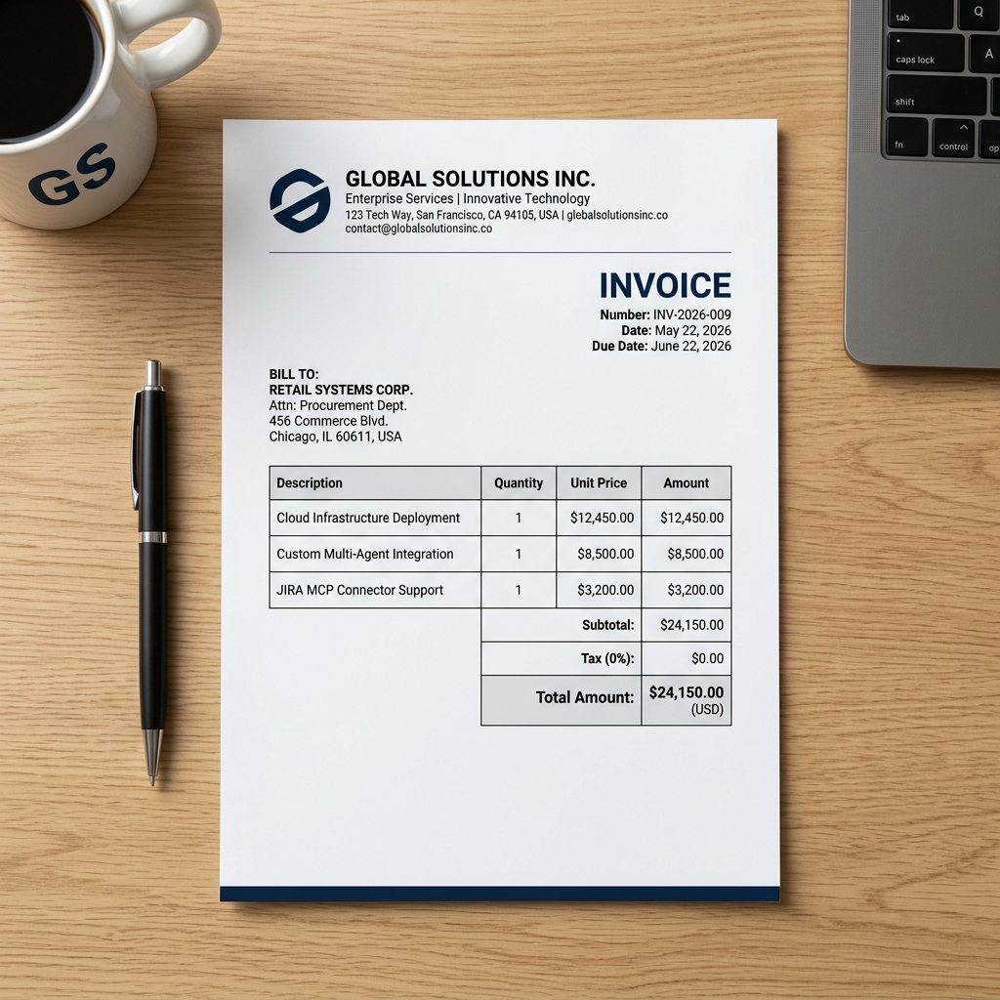
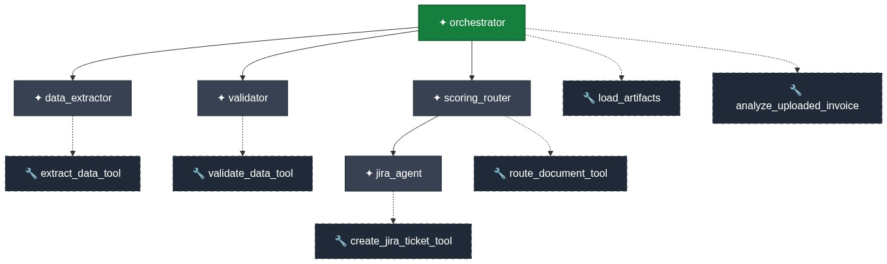
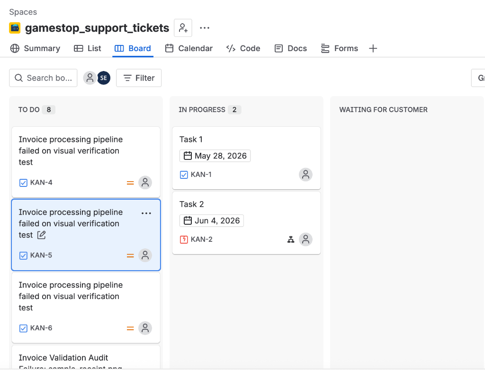
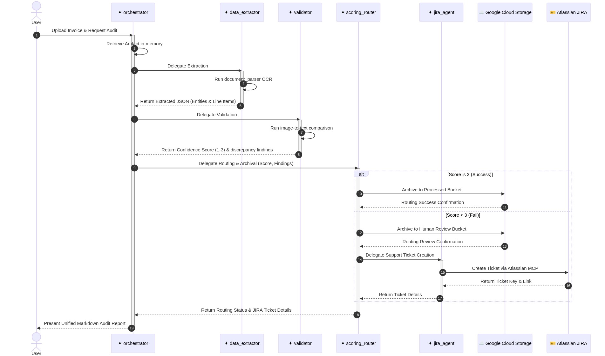

# Multi-Agent Retail Invoice Auditor (Plain ADK)

This folder contains a flat, pure **Google Agent Development Kit (ADK)** agent workspace that implements a sequential multi-agent pipeline designed to automate retail store invoice auditing, data validation, cloud archival routing, and automated helpdesk ticket resolution.

---

## 🎯 Core Capabilities

The system provides an automated, end-to-end store invoice auditing pipeline with the following capabilities:

*   **Automated Data Extraction**: Employs advanced parsing models to analyze variable-format store receipts and invoices, cleanly extracting key store taxonomies (Merchant name, address, phone), transaction headers (Date, Time, Cashier ID), financial summaries (Subtotal, Tax, Total, Payment Method), and granular line-item details.
*   **Dual-Model Visual Audit Validation**: Combines the structured output of Google Cloud Document AI with the visual spatial reasoning of **Gemini 2.5 Flash**. It performs a line-by-line, visually grounded comparison to check for discrepancies between the extracted data and the original document image, scoring confidence on a 1–3 scale.
*   **GCS Cloud Archival & Routing**: Automatically evaluates audit confidence.
    *   **Score 3 (Perfect Match)**: Archives the document directly in the GCS Processed bucket.
    *   **Score < 3 (Discrepancy/Anomaly)**: Routes the document to the GCS Human Review bucket for manual intervention.
*   **Dynamic JIRA Ticketing Sub-Agent**: When a discrepancy is flagged (Score < 3), the router delegates to a specialized JIRA MCP sub-agent to automatically log a support ticket with a structured finding report (including discrepancy summaries and GCS review links) on your Atlassian Cloud support board.

## 📷 Sample Enterprise Invoice Example

Below is the high-resolution, premium B2B enterprise invoice asset used for testing extraction and visual audit validation inside the pipeline:



---

## 🏗️ Multi-Agent Architecture

The agent workspace defines a nested parent-child relationship tree, modeled natively using ADK's `sub_agents` property.



### 1. `orchestrator_agent` (Root Coordinator)
*   **Model**: `gemini-2.5-flash`
*   **Role**: The primary store auditor. Coordinates the specialists sequentially and aggregates the final markdown report.
*   **Tools**: `load_artifacts`, `analyze_uploaded_invoice`
*   **Sub-Agents**: `data_extractor_agent`, `validator_agent`, `scoring_routing_agent`

### 2. `data_extractor_agent` (Specialist Extractor)
*   **Model**: `gemini-2.5-flash`
*   **Role**: Expert retail document parser. Identifies Merchant Name, Invoice Date, Tax, Total, and line-item entities.
*   **Tools**: `extract_data_tool` (drives `document_parser.py`)

### 3. `validator_agent` (Specialist Auditor)
*   **Model**: `gemini-2.5-flash`
*   **Role**: Validation auditor. Performs image-to-text comparisons to verify the accuracy of extracted fields directly against what is visually readable in the receipt.
*   **Tools**: `validate_data_tool` (drives `gemini_parser.py`)

### 4. `scoring_routing_agent` (Specialist Routing & Ticket Coordinator)
*   **Model**: `gemini-2.5-flash`
*   **Role**: Archives documents depending on validation score. If the score is below 3 (fail/discrepancy), it delegates the task to `jira_agent` to raise a support issue.
*   **Tools**: `route_document_tool` (GCS routing client)
*   **Sub-Agents**: `jira_agent`

### 5. `jira_agent` (Integration Support Agent)
*   **Model**: `gemini-2.5-flash`
*   **Role**: Specialist JIRA assistant. Connects via our thread-safe async ThreadPool MCP execution bridge to raise support tickets on the Atlassian cloud board.
*   **Tools**: `create_jira_ticket_tool` (Atlassian MCP integration)
*   **JIRA Ticket Automation Board**: Below is the live screenshot of the Atlassian Cloud JIRA board (`gamestop_support_tickets`) displaying the support tickets (`KAN-4`, `KAN-5`, `KAN-6`) created dynamically and automatically by the sub-agent:
    

---

## ⏱️ Multi-Agent Execution Sequence Diagram

This sequence diagram illustrates the step-by-step execution timeline of the JIRA-integrated multi-agent pipeline:



---

## 📁 Flat Package Structure

```text
ge_fileagent/
├── agent.py           # Main definitions (Orchestrator + Specialists + sub_agents)
├── document_parser.py # OCR & Entity extraction client
├── gemini_parser.py   # Image audit comparison & validation client
├── .env               # Configuration tokens (Vertex AI, GCS, JIRA)
├── requirements.txt   # Cloud container dependencies (mcp, Pillow, sse-starlette)
└── README.md          # Setup and Multi-Agent Architecture documentation
```

---

## ⚙️ JIRA MCP Configuration

The JIRA sub-agent (`jira_agent`) utilizes the Model Context Protocol (MCP) to interact with the Atlassian cloud. It supports two runtime transport modes natively:

### A. Local Stdio Mode (Default / Local Testing)
Spawns a local subprocess running the Atlassian JIRA MCP server. 
*   **Binary Path**: Resolved dynamically relative to this package directory: `ge_fileagent/mcp-atlassian` (completely self-contained).
*   **Standard Environment Variables**:
    *   `JIRA_URL`: `https://google-team-vwhbosar.atlassian.net` (Atlassian cloud domain).
    *   `JIRA_USERNAME`: Derived automatically from your `JIRA_EMAIL` setting.
    *   `JIRA_API_TOKEN`: Your Atlassian Personal API Token.
    *   `TOOLSETS`: Set to `"all"`.

### B. SSE Cloud Mode (Production / Cloud Deploy)
Connects to a remotely hosted Atlassian MCP server using Server-Sent Events (SSE).
*   **Activation**: Set the `JIRA_MCP_URL` environment variable inside the `.env` file:
    ```env
    JIRA_MCP_URL=https://your-mcp-server.endpoints/sse
    ```
*   **Authentication**: The agent automatically extracts `JIRA_EMAIL` and `JIRA_API_TOKEN`, converts them to basic base64-encoded authorization headers, and performs secure tokenized handshake exchanges.

---

## ⚙️ Local .env Configuration

To run the auditor locally, create a `.env` file inside `ge_fileagent/` and configure these variables:

```env
# 1. Bypass setting for corporate OpenSSL mTLS checks (Mandatory!)
GOOGLE_API_USE_CLIENT_CERTIFICATE=false

# 2. Vertex AI Cloud settings
GOOGLE_GENAI_USE_VERTEXAI=true
GOOGLE_CLOUD_PROJECT=<GCP_PROJECT_ID>
GOOGLE_CLOUD_LOCATION=us-central1
GEMINI_MODEL_NAME=gemini-2.5-flash

# 3. Google Cloud Storage (GCS) Archival Buckets
NESS_PROCESSED_DOCS_BUCKET=gamestop-processed-docs-<GCP_PROJECT_ID>
NESS_HUMAN_REVIEW_BUCKET=gamestop-review-docs-<GCP_PROJECT_ID>

# 4. JIRA Integration credentials
JIRA_EMAIL=<USER_EMAIL>
JIRA_API_TOKEN=<YOUR_ATLASSIAN_PAT_TOKEN>
```

---

## ☁️ Google Cloud Authentication

Before running the local server, your terminal session must be authenticated with Google Cloud to access Vertex AI and GCS bucket resources:

```bash
# 1. Authenticate with your Google Cloud user account
gcloud auth login

# 2. Authenticate Application Default Credentials (ADC)
# (This is mandatory for the python google-genai SDK to run locally!)
gcloud auth application-default login

# 3. Set your default cloud project
gcloud config set project <GCP_PROJECT_ID>
```

---

## 🚀 How to Run Locally

First, make sure you are in this directory:
```bash
cd ge_fileagent
```

### Step 1: Stage the isolated copy
To satisfy ADK's strict security traversal checks, create an isolated staging copy in your local `/tmp/` directory:
```bash
rm -rf /tmp/adk_agents/ge_fileagent
mkdir -p /tmp/adk_agents/ge_fileagent
cp -r ge_fileagent/* /tmp/adk_agents/ge_fileagent/
cp ge_fileagent/.env /tmp/adk_agents/ge_fileagent/
```

### Step 2: Start the visual playground
Start the playground local server by running:
```bash
export GOOGLE_API_USE_CLIENT_CERTIFICATE=false
export GOOGLE_GENAI_USE_VERTEXAI=true
export GOOGLE_CLOUD_PROJECT=<GCP_PROJECT_ID>
export GOOGLE_CLOUD_LOCATION=us-central1

<WORKSPACE_DIR>/gamestop_invoice/venv/bin/adk web /tmp/adk_agents
```

Once launched, navigate to **`http://127.0.0.1:8000`**, select **`ge_fileagent`**, upload a receipt, and run your audit prompt!

---

## ☁️ Cloud Deployment & Gemini Enterprise Registration

Follow this operational manual to host your JIRA-integrated flat agent in the cloud and connect it natively to your Gemini Enterprise application:

### Step 1: Deploy to Vertex AI Agent Engine (Reasoning Engine)
Run the deploy command from the parent directory to bundle your flat ge_fileagent package:
```bash
export GOOGLE_API_USE_CLIENT_CERTIFICATE=false
<WORKSPACE_DIR>/gamestop_invoice/venv/bin/adk deploy agent_engine ge_fileagent --project <GCP_PROJECT_ID> --region us-central1 --display_name GeFileAgent --description "Plain ADK expert multi-agent retail invoice auditor with JIRA integration." --requirements_file ge_fileagent/requirements.txt
```
Wait for the provisioning to complete. Copy the returned **Reasoning Engine Resource ID** (for example: `projects/943928157761/locations/us-central1/reasoningEngines/8673214351466823680`).

### Step 2: Register as a Custom Agent in Gemini Enterprise
1.  Open the **Google Cloud Console** and navigate to **Discovery Engine -> Agent Search**.
2.  Select your active Enterprise App ID: **`gemini-enterprise-1771779446347`** (Resource ID: `gemini-enterprise-17717794_1771779446347`).
3.  Click **Add Agent / Register Agent**.
4.  Choose **Custom Agent** (which communicates natively with plain ADK Reasoning Engine endpoints).
5.  Under the **Agent Card JSON** configuration, paste this exact specification:

```json
{
  "protocolVersion": "0.3.0",
  "name": "ge_fileagent",
  "description": "Expert multi-agent retail store auditor.",
  "url": "https://us-central1-aiplatform.googleapis.com/v1beta1/projects/943928157761/locations/us-central1/reasoningEngines/<YOUR_DEPLOYED_ENGINE_ID>",
  "version": "1.0.0",
  "defaultInputModes": ["text/plain"],
  "defaultOutputModes": ["text/plain"],
  "preferredTransport": "HTTP+JSON",
  "capabilities": {
    "streaming": false,
    "extensions": []
  },
  "skills": [
    {
      "id": "ge_fileagent",
      "name": "Multi-Agent Store Invoice Auditor",
      "description": "Extracts retail entities, performs image-to-text validation, routes processed documents to GCS, and dynamically raises JIRA support tickets for discrepancies.",
      "tags": ["invoice", "audit", "jira", "gcs"],
      "examples": [
        "Analyze this uploaded invoice",
        "Run store audit pipeline"
      ]
    }
  ]
}
```
*(Replace `<YOUR_DEPLOYED_ENGINE_ID>` with the actual Reasoning Engine ID copied in Step 1!)*

### Step 3: Test inside your Gemini Enterprise Chat
1.  Go to your Gemini Enterprise chat assistant console interface.
2.  Attach/Upload your invoice or receipt image or PDF.
3.  Type **`Analyze this invoice`** or **`Run audit`**.
4.  The cloud Reasoning Engine will dynamically download the file in-memory directly from GCS, coordinate the specialists, route archives, raise a JIRA ticket if discrepancies exist, and present the detailed markdown report directly in your chat!

